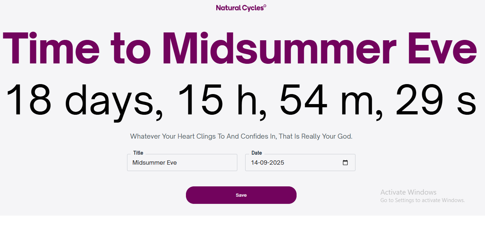

## NcCountdown

A tiny Angular app that shows a **full-width, single-line** countdown (“_X days, Y h, Z m, S s_”) and a **quote of the day**.  
Built with Angular **Components** and a reusable **Text-Fit** directive.  
Generated with Angular CLI **20.2.x.**. Works on desktop + mobile (portrait & landscape).

---

## Quick start

```bash
npm install
npm start   # http://localhost:4200
```

---

## Prerequisites

- Node.js **v20.19+** or **v22.12+**
- npm **22.18.0**
- (Optional) Global Angular CLI; the project uses the local CLI via `npx`.

---

## Build

```bash
npm run build
# output: dist/nc-countdown/browser
```

---

## Format (Prettier)

```bash
npm run format        # write
npm run format:check  # verify
```

```js
// prettier.config.js
module.exports = {
  printWidth: 80,
  tabWidth: 2,
  useTabs: false,
  semi: false,
  singleQuote: true,
  trailingComma: 'all',
  bracketSpacing: true,
}
```

## Development

Run `npm start` in one terminal and `npm run format:check -- --watch` in another to auto-check formatting.

---

## What the app does

- **Title**: “Time to _{Event}_” — fitted to one line, fills the width.
- **Countdown**: “_N days, H h, M m, S s_” — updates every second, fitted to one line.
- **Quote of the day**: fetched from `https://dummyjson.com/quotes/random` with an **in-place** loading indicator (rest of the page stays interactive).
- **Form**: Title + Date (`YYYY-MM-DD`). **Save** persists to `localStorage`.

---

## How it works

- **Text-Fit directive (reusable)**  
  Measures text in a hidden element and **binary-searches** the largest `font-size` that fits the available width (no wrap). Uses `ResizeObserver` for container resizes.  
  Inputs:
  - `minPx`, `maxPx` — bounds
  - `paddingPx` — breathing room subtracted from width
  - `onlyOnResize` — if `true`, don’t refit on content changes
  - `refText` — optional “longest” sample string

  Both the event title and the countdown line ("N days, H h, M m, S s") use the custom TextFitDirective. The directive measures text and automatically adjusts font-size so each line fills the entire screen width on a single line.

  Title → resizes as the event name changes.
  Countdown → resizes as numbers tick down, with refText="88 days, 88 h, 88 m, 88 s" ensuring consistent sizing.
  This makes the solution reusable and guarantees the design requirement: always full-width, always single-line, across devices and orientations.

Example:

```html
<span
  appTextFit
  [minPx]="20"
  [maxPx]="1200"
  [paddingPx]="16"
  [onlyOnResize]="true"
  [refText]="'88 days, 88 h, 88 m, 88 s'"
>
  {{ remainingLabel() }}
</span>
```

- **State (Angular Signals)**  
  `settings` (persisted `{ eventName, endIso }`), `formEventName`/`formDate` (live inputs), and computed `targetMs`/`remainingParts`/`remainingLabel` for the countdown.  
  Quote UX uses `quote`, `quoteLoading`, `quoteError`.

- **Persistence**  
  `StorageService` reads/writes `localStorage` under key `nc.settings.v1` and migrates old `endDate` → `endIso`.

- **Accessibility**  
  Countdown line has `aria-live="polite"`. Quote spinner is local, not page-blocking.

---

## Project structure

```
src/
  app/
    app.component.html
    app.component.ts
    directives/
      text-fit.directive.ts
    services/
      storage.service.ts
    types.ts
  assets/
    nc-logo.png
styles.scss
```

---

## Scripts reference

```bash
npm start         # ng serve
npm run build     # production build
npm run watch     # build --watch
npm run format    # prettier --write .
npm run format:check
```

---

## Deployment

- **Netlify (recommended)**
  - Build command: `npm run build`
  - Publish directory: `dist/nc-countdown/browser`

- **GitHub Pages (static)**
  - `npm run build`
  - Serve `dist/nc-countdown/browser` with any static host (e.g., copy to `/docs`).

---

## Troubleshooting

- **Node version**: use Node **20.19+** or **22.12+**.
- **CLI mismatch**: prefer `npx ng ...` to force the project’s CLI.
- **Quote fails**: shows an error + **Retry**; we intentionally don’t cache.
- **LocalStorage blocked**: app works, but settings won’t persist.

---

## Assignment checklist

- [x] Angular + TypeScript
- [x] Portrait & landscape; single-line, full-width text
- [x] **Reusable** text-fit solution
- [x] Editable **event name + date**, persisted
- [x] Countdown format: `Days, Hours(h), Minutes(m), Seconds(s)`
- [x] Quote from `dummyjson.com/quotes/random` (no caching, in-place loader)
- [x] Prettier formatting as specified
- [x] README + deployable build

---

## Demo

Here’s how the app looks:

**Mobile view**


**Desktop view**



## Suggestions for improvement / Production readiness

I’m happy with the core solution — it’s clean, accurate, and resilient — but if this were shipping inside a popular app like Natural Cycles, here’s what I’d add before calling it production-ready:

1. Accessibility & inclusivity
   Natural Cycles is a certified medical app and must work for everyone.

- Make the big ticking line visual-only (aria-hidden="true") and provide a calmer, screen-reader-friendly summary
  (e.g. “Event ends in 3 days, 2 hours”).
- Confirm keyboard flow, focus styles, and color contrast meet WCAG.
- Add dark mode support for comfort.
  Ensures everyone can use it regardless of ability or environment.

2. Internationalization & localization
   Natural Cycles operates in 150+ countries, so language and time correctness matter.

- Pluralization in multiple languages (days vs Tage vs días).
- Localize “h/m/s” abbreviations.
- Allow choosing an exact time & time zone to avoid DST surprises.
  Builds global trust and avoids confusion around dates/times.

3. Quality guardrails
   Before release, I’d add:

- Unit tests for countdown math + text-fit directive edge cases.
- CI pipeline: lint, format:check, test, build.

4. Future-proof features
   Not required for MVP, but worth exploring:

- Multiple countdowns (switchable events).
- Shareable links (?event=Birthday&date=2025-12-12).
- Lightweight PWA so users can “install” the countdown.
  Keeps the solution scalable and ready for growth.

  ** The solution as-is is solid for the assignment — it’s accurate (no drift), inclusive (text-fit works everywhere), private (data is local), and resilient (quotes don’t block the UI).
  If I were preparing this for Natural Cycles’ production standards, I’d polish the accessibility, global reach, and trust aspects: screen-reader comfort, multilingual support, explicit privacy messaging, and quality guardrails. These aren’t just technical extras; they’re what turn a neat demo into a product people trust their health with. **
